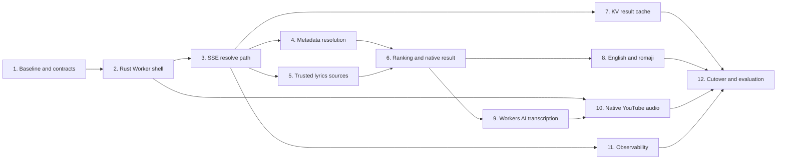

# Rust Worker Throwaway Prototype

This document splits the Rust-on-Cloudflare-Workers migration prototype into
independently assignable workstreams. The prototype exists to expose technical
and product shortcomings before a better second implementation is designed. It
is not intended to become the production architecture through incremental
polishing.

## Coordination rules

Each workstream agent must:

- Write a short spec in this directory before implementation.
- Name it `task-XX-<short-name>.md`.
- Work on a separate branch or worktree.
- Implement only the assigned slice.
- Include tests and append implementation findings to its spec.
- Preserve established contracts unless the task explicitly owns them.
- Avoid broad cleanup and production hardening.
- Use Caveman as required by `AGENTS.md`.

At the time this plan was written, the `caveman` executable was installed but
could not run because no model provider or API key was configured. Agents should
record the same constraint in their spec if it remains unavailable rather than
blocking their work.

## Dependency map

## Shared integration decisions

- Task 3 owns the wire protocol. Later tasks may add payload fields without
  changing event names or semantics.
- Task 6 owns the canonical result and candidate models.
- Task 7 caches complete Task 6, 8, and 9 results rather than individual
  provider responses.
- Task 9 owns transcription policy. Task 10 only changes audio acquisition.
- Task 2 preserves complete API compatibility by forwarding to the legacy
  Worker. Individual legacy routes are not rewritten.
- Task 12 is the only task authorized to make the Rust pipeline the frontend
  default.
- Free and no-key sources define baseline functionality. Keyed services may be
  optional enhancements but cannot be required.
- The implementation targets `wasm32-unknown-unknown` with `workers-rs`.
- Audio must be range-fetched and chunked to remain within the Workers 128 MB
  isolate memory limit.

## Task 1: Freeze baselines and API contracts

**Can start:** Immediately

**Agent prompt**

Establish the immutable evidence used to judge the Rust Worker prototype.
Capture the current `/api/*` route inventory, representative response shapes,
reference-track expectations, and old-pipeline performance without changing
runtime behavior. Write `task-01-baselines-and-contracts.md`, implement the
fixtures and tests, and record the measured baseline in the spec.

**Deliverables**

- Versioned route inventory and compatibility expectations.
- Expanded multilingual and failure fixture corpus.
- Repeatable benchmark for current lyrics latency, API calls, and success.
- Contract tests reusable against both legacy and Rust Workers.

**Acceptance criteria**

- Every current router path is classified and covered by a contract or smoke
  test.
- The existing six reference tracks remain included.
- Fixtures cover unavailable video, wrong metadata, no lyrics, instrumental
  content, scraper junk, and non-English output.
- Baseline measurements are recorded in the spec.

## Task 2: Introduce the Rust public Worker shell

**Blocked by:** Task 1

**Agent prompt**

Make a `workers-rs` Worker the public entrypoint while preserving current
behavior. It must serve frontend assets and forward all existing `/api/*`
requests to the frozen TypeScript Worker through a service binding. Write
`task-02-rust-worker-shell.md` before implementation.

**Deliverables**

- Rust/Wasm project and build integration.
- Static-assets binding.
- Legacy Worker service binding.
- Explicit route forwarding, security headers, redirects, and error handling.
- Local and deployed smoke tests.

**Acceptance criteria**

- The application loads through the Rust Worker.
- All baseline API compatibility tests pass through the Rust gateway.
- Streaming responses and range requests are forwarded without buffering.
- Failures identify whether they originated in Rust or the legacy Worker.

## Task 3: Add the versioned SSE lyrics-resolution path

**Blocked by:** Task 2

**Agent prompt**

Add the new end-to-end protocol without implementing intelligent resolution
yet. The Rust endpoint must validate requests, stream progress, return a
deterministic placeholder or legacy-backed result, and be consumable by an
experimental frontend adapter. Write `task-03-sse-resolution-contract.md`
before implementation.

**Owned contract**

- Endpoint: `POST /api/lyrics/resolve`
- Request: `videoId`, optional title, author, duration, language, and
  `forceRefresh`.
- Events: `phase`, `metadata`, `candidate`, `warning`, `result`, and `error`.
- Every event includes a protocol version, request ID, and timestamp.

**Acceptance criteria**

- SSE events arrive before request completion.
- Client disconnects cancel remaining work.
- Invalid input produces a typed terminal error.
- The frontend can display streamed phases and consume a final result behind a
  prototype switch.
- Contract tests lock the wire format for later agents.

## Task 4: Resolve canonical track metadata

**Blocked by:** Task 3

**Agent prompt**

Replace browser-side metadata orchestration for the new endpoint. Resolve and
rank canonical artist, track, and duration using supplied YouTube data, oEmbed,
MusicBrainz, and Deezer. Write `task-04-metadata-resolution.md` before
implementation.

**Acceptance criteria**

- Metadata events expose candidates, source, and scoring reasons.
- Canonical results are deterministic for fixtures.
- Timeouts and individual source failures do not fail the complete request.
- Stable identifiers are preserved when available.
- Incorrect YouTube titles can resolve through alternate candidates.
- No keyed provider is required.

## Task 5: Implement the trusted lyrics source cascade

**Blocked by:** Task 3

**Agent prompt**

Implement only the approved source policy: LRCLIB exact lookup, LRCLIB variant
search, lyrics.ovh, then Genius scraping. Normalize all responses into the
shared candidate model. Write `task-05-trusted-lyrics-cascade.md` before
implementation.

**Acceptance criteria**

- Sources run as a staged cascade rather than broad uncontrolled fan-out.
- A strong synchronized LRCLIB match prevents unnecessary fallback calls.
- Each candidate includes source, metadata, lyric text, synchronization state,
  and diagnostics.
- HTML, snippets, empty responses, and scraper noise are rejected safely.
- Per-source timeouts and failure classifications are tested.
- No additional provider is added.

## Task 6: Rank candidates and build native lyrics

**Blocked by:** Tasks 4 and 5

**Agent prompt**

Combine metadata and lyrics candidates into one explainable native result. Port
only heuristics that prove useful; do not reproduce the existing ranking system
mechanically. Write `task-06-ranking-and-native-result.md` before
implementation.

**Acceptance criteria**

- Ranking considers artist, title, duration, synchronization, completeness,
  language, and junk indicators.
- Scores include machine-readable reason components.
- LRC parsing produces timed lyric lines.
- Plain lyrics receive explicitly approximate timing.
- The best result and useful alternates are returned.
- Instrumental, low-confidence, and not-found outcomes remain distinct.
- Reference-track native lyric assertions pass.

## Task 7: Add versioned KV result caching

**Blocked by:** Task 3

**Agent prompt**

Add caching around the complete resolution operation without coupling the
cache to individual provider implementations. Write
`task-07-kv-result-cache.md` before implementation.

**Acceptance criteria**

- Cache keys include video ID and pipeline version.
- Successful, negative, and transient outcomes use different TTL policies.
- `forceRefresh` bypasses reads and replaces eligible entries.
- Cache hits still emit valid SSE progress and final events.
- Corrupt and outdated entries are ignored safely.
- Concurrent requests do not cause obvious duplicate writes.
- Tests use local or mocked KV bindings.

## Task 8: Produce English lyrics and romaji

**Blocked by:** Task 6

**Agent prompt**

Extend accepted native results with optional English and romaji output. Search
for actual English lyrics before translating, use free/no-key translation
fallbacks, and preserve only the current minimum Japanese romanization
compatibility. Write `task-08-english-and-romaji.md` before implementation.

**Acceptance criteria**

- English native songs skip unnecessary translation.
- Non-English songs first attempt a trusted English lyric candidate.
- Translation failures do not discard native lyrics.
- Output lines align with native lines or declare degraded alignment.
- Japanese fixtures produce useful romaji.
- Unsupported romanization languages are reported explicitly.
- Results identify whether English was found or translated.

## Task 9: Add Workers AI verification and transcription

**Blocked by:** Task 6

**Agent prompt**

Use Workers AI Whisper to verify weak candidates and produce plain lyrics when
no acceptable source result exists. Initially acquire audio through the legacy
Worker service binding. Write `task-09-workers-ai-transcription.md` before
implementation.

**Acceptance criteria**

- Strong source matches do not invoke Workers AI.
- Weak candidates use a bounded sample transcription.
- Full transcription runs only for not-found or rejected results.
- Audio is range-fetched and chunked within the 128 MB isolate limit.
- Transcription cost-relevant metrics are emitted.
- Failed transcription returns a typed partial or not-found result.
- The result records `usedLegacyAudioAdapter: true`.

## Task 10: Replace the legacy YouTube audio adapter

**Blocked by:** Tasks 2 and 9

**Agent prompt**

Test whether Rust can resolve and fetch YouTube audio reliably enough for
transcription. Implement a minimal InnerTube client chain rather than porting
`youtubei.js`. Write `task-10-native-youtube-audio.md` before implementation.

**Acceptance criteria**

- The resolver validates video IDs and stream hosts.
- It tries a documented and bounded client sequence.
- Audio URLs support range requests needed by transcription.
- Resolver attempts and playability failures are observable.
- Native resolution is attempted first.
- The legacy service remains an explicit fallback.
- Reference fixtures report native-versus-legacy success rates.

## Task 11: Add prototype observability and comparison data

**Blocked by:** Task 3

**Agent prompt**

Make every resolution explainable without introducing a production analytics
platform. Instrument the SSE pipeline and provide a legacy-versus-Rust
comparison harness. Write `task-11-observability-and-benchmarks.md` before
implementation.

**Acceptance criteria**

- Structured logs include request ID, phase timings, source outcomes, cache
  status, transcription calls, and legacy-adapter use.
- Lyrics content and audio URLs are never logged.
- A benchmark can run identical fixtures against legacy and Rust paths.
- Reports include time to first event, final latency, request count, selected
  source, cache latency, and failure category.
- Logging failures never fail lyrics resolution.

## Task 12: Cut over the frontend and publish findings

**Blocked by:** Tasks 7, 8, 10, and 11

**Agent prompt**

Make the Rust SSE pipeline the frontend's active lyrics-loading path, remove
runtime dependence on the browser orchestrator, run the complete evaluation,
and document what a second implementation should change. Write
`task-12-cutover-and-findings.md` before implementation.

**Acceptance criteria**

- The frontend delegates metadata, provider search, ranking, translation,
  romaji, and transcription decisions to Rust.
- Existing playback, rendering, manual lyrics, and synchronization controls
  still work.
- Legacy `/api/*` compatibility tests continue passing through the Rust
  gateway.
- The full fixture corpus and browser journey pass.
- Old and new benchmark results are compared.
- The findings document lists confirmed strengths, shortcomings, Rust/Workers
  limitations, source-policy results, and recommendations for version two.
- Legacy code is not deleted unless it is unreachable and removal is necessary
  for a valid comparison.

## Suggested assignment order

1. Complete Task 1, then Task 2, then Task 3 sequentially.
2. Run Tasks 4, 5, 7, and 11 in parallel.
3. Complete Task 6 after Tasks 4 and 5.
4. Run Tasks 8 and 9 in parallel after Task 6.
5. Complete Task 10 after Task 9.
6. Complete Task 12 after Tasks 7, 8, 10, and 11.

## Prototype evaluation questions

The final findings must answer:

- Does moving orchestration to Rust materially simplify the frontend?
- Is a small trusted source cascade more accurate and faster than the current
  broad provider graph?
- Can Rust resolve YouTube audio reliably without `youtubei.js`?
- Is server-side Workers AI transcription affordable and reliable enough to be
  a fallback?
- Which parts of `workers-rs` or Wasm introduce unacceptable friction?
- Does centralized KV caching materially reduce latency and upstream load?
- Which contracts and algorithms should be retained, redesigned, or discarded
  in the second implementation?
