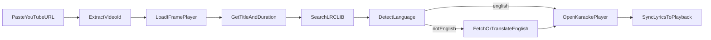
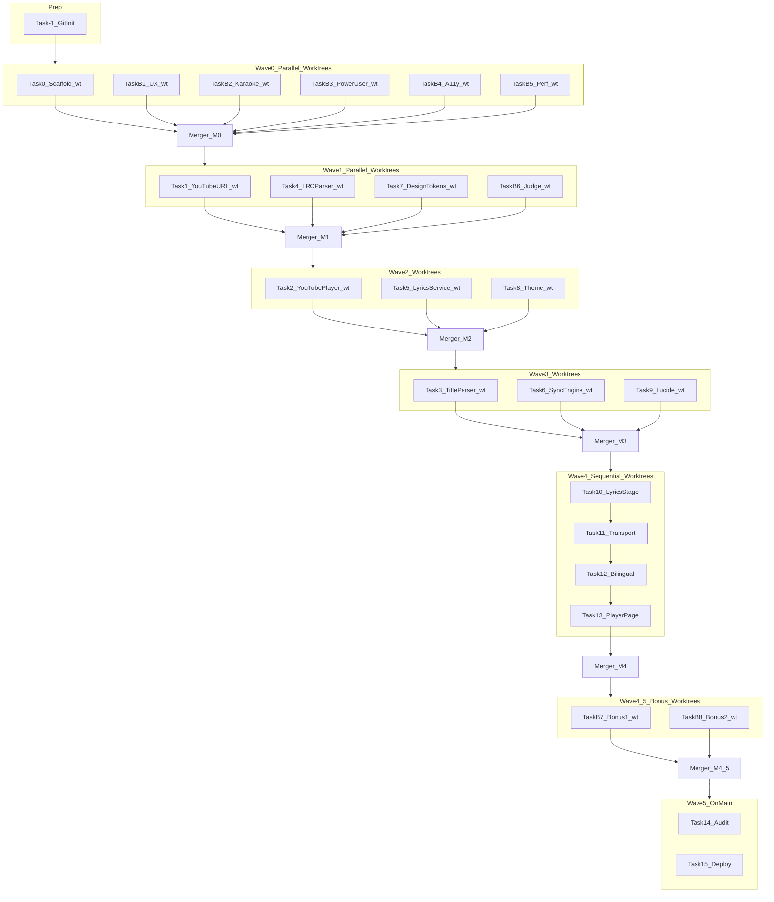

# Lyrics Karaoke Player Implementation Plan

> **For agentic workers:** REQUIRED SUB-SKILLS: `superpowers:subagent-driven-development` (recommended) + `superpowers:using-git-worktrees` (mandatory) + `superpowers:verification-before-completion` (mandatory) + **Browser MCP** (mandatory for all runnable-code tasks).

**Goal:** A static karaoke website where users paste a YouTube song URL and sing along with synced, optionally bilingual lyrics — all processing in the browser.

**Architecture:** Vite + React SPA with three client-side domains: (1) YouTube IFrame player for playback/time, (2) LRCLIB API for synced/plain lyrics with CORS, (3) karaoke sync engine mapping `currentTime → active line/word`. Non-English songs show native lyrics plus English via a second LRCLIB search and/or Chrome Translator API fallback. No backend; deploy `dist/` to Cloudflare static assets.

**Parallel execution model:** Every subagent works in an isolated **git worktree** on its own branch. After each wave completes, a **Merger agent** integrates branches into `main`, runs the test suite, resolves conflicts, and removes stale worktrees.

**Tech Stack:** Vite 7, React 19, TypeScript, Tailwind CSS v4, shadcn/ui (new-york), Motion, **lucide-animated** (required), Vitest + Testing Library, `@bogdanrn/yt-embed/react`, LRCLIB REST API, `franc` (language detection), Zod, Cloudflare Wrangler static assets.

**Plan file (on approval):** Save full version to `[docs/superpowers/plans/2026-06-15-lyrics-karaoke-player.md](docs/superpowers/plans/2026-06-15-lyrics-karaoke-player.md)`

---

## Design Study

### User journey




### Visual layout (karaoke stage)


| Zone              | Purpose                                                                                     |
| ----------------- | ------------------------------------------------------------------------------------------- |
| **Header bar**    | App title, theme toggle (lucide-animated icons), settings                                   |
| **Video panel**   | YouTube embed; collapsible via "Hide video" toggle (lyrics-only mode)                       |
| **Lyrics stage**  | Large centered text; active line highlighted; auto-scroll keeps active line in middle third |
| **Transport bar** | Play/pause, seek scrubber, sync offset ±0.5s, lyric display mode (Native / English / Both)  |


**Scene (impeccable):** Dim venue, screen glow — **dark-first** theme with a saturated accent (magenta or electric violet, OKLCH). Light mode available via theme switcher. Typography: one grotesque sans (e.g. **DM Sans** or **Outfit**) at large scale for lyrics (`clamp(1.5rem, 4vw, 3rem)` active line).

**Karaoke highlight behavior:**

- **Synced (LRC):** Active line gets accent color + slight scale; within-line word progress via linear interpolation between line start/end timestamps (CSS `background-clip: text` gradient sweep — solid colors only, no gradient-text decoration on headings per impeccable).
- **Unsynced fallback:** Evenly distribute lines across `duration`; highlight whole lines only; show banner "No synced lyrics — approximate timing".
- **Reduced motion:** Crossfade line changes, disable scale; respect `MotionConfig reducedMotion="user"`.

**Bilingual display modes:**

- **Native only** — default when English detected
- **English only** — translation column
- **Both** — stacked: native line above, English below in muted smaller text

---

## File Structure

```
song-kara/                         # main worktree (integration branch: main)
├── .git/
├── .gitignore                     # includes .worktrees/, node_modules/, dist/
├── .worktrees/                    # gitignored — linked worktrees for subagents
│   ├── wave0-scaffold/
│   ├── brainstorm-b1-ux/
│   └── ...
├── wrangler.jsonc                 # Cloudflare SPA deploy
├── vite.config.ts
├── vitest.config.ts
├── components.json                # shadcn
├── src/
│   ├── main.tsx
│   ├── App.tsx
│   ├── index.css                  # Tailwind v4 + OKLCH tokens
│   ├── lib/
│   │   ├── utils.ts               # cn()
│   │   ├── youtube-url.ts         # parse videoId from URL
│   │   ├── parse-track-title.ts   # "Artist - Song" heuristics
│   │   ├── lrc-parser.ts          # LRC → LyricLine[]
│   │   ├── lyrics-service.ts      # LRCLIB fetch + match by duration
│   │   ├── language-service.ts    # franc detect + Translator API
│   │   └── sync-engine.ts         # currentTime → activeIndex + wordProgress
│   ├── hooks/
│   │   ├── use-youtube-player.ts  # yt-embed wrapper
│   │   ├── use-lyrics-sync.ts     # rAF sync loop
│   │   └── use-translation.ts     # Chrome Translator API
│   ├── stores/
│   │   └── player-store.ts        # Zustand: video, lyrics, UI prefs
│   ├── components/
│   │   ├── ui/                    # shadcn primitives
│   │   ├── icons/                 # lucide-animated (via shadcn CLI)
│   │   ├── theme-provider.tsx
│   │   ├── mode-toggle.tsx
│   │   ├── url-input.tsx
│   │   ├── youtube-panel.tsx
│   │   ├── lyrics-stage.tsx
│   │   ├── lyric-line.tsx
│   │   ├── transport-controls.tsx
│   │   └── app-shell.tsx
│   ├── pages/
│   │   ├── home-page.tsx
│   │   └── player-page.tsx
│   └── types/
│       └── lyrics.ts
├── tests/
│   ├── lib/youtube-url.test.ts
│   ├── lib/lrc-parser.test.ts
│   ├── lib/parse-track-title.test.ts
│   ├── lib/sync-engine.test.ts
│   └── lib/lyrics-service.test.ts
└── docs/superpowers/
    ├── specs/2026-06-15-lyrics-karaoke-design.md
    ├── plans/2026-06-15-lyrics-karaoke-player.md
    └── backlog/
        ├── proposals/               # one file per brainstorm subagent output
        │   ├── FB-ux-001.md
        │   ├── FB-karaoke-001.md
        │   └── ...
        ├── approved.md              # judge output: ordered implement queue
        └── rejected.md              # judge output: declined + reasons
```

---

## Subagent Orchestration

### Agent roles


| Agent | Skill | When dispatched |
| ----- | ----- | --------------- |
| **Coordinator** | (parent session) | Orchestrates dispatch, tracks branch list, triggers mergers |
| **Merger agent** | generalPurpose (capable model) | Tasks M0–M5 after each wave; merges worktrees → `main` |
| **Scaffolder** | generalPurpose + using-git-worktrees | Task 0 in `.worktrees/wave0-scaffold` |
| **Feature brainstorm adder** | brainstorming + using-git-worktrees | Tasks B1–B5, one worktree each |
| **Feature judge** | generalPurpose + using-git-worktrees | Task B6 in `.worktrees/brainstorm-b6-judge` |
| **Bonus feature implementer** | generalPurpose + using-git-worktrees | Tasks B7+, one worktree each |
| **Core implementer** | generalPurpose + using-git-worktrees | Tasks 1–6, 10–13, 15 |
| **Frontend designer** | impeccable + using-git-worktrees | Tasks 7–9, 11 (visual pass) |
| **Frontend reviewer** | impeccable (`reference/audit.md`) + react-best-practices | After Waves 2–3 and Wave 4.5 |
| **Spec reviewer** | subagent-driven-development spec stage | After each task (pre-merge) |
| **Code quality reviewer** | code-simplifier / find-bugs | After spec pass (pre-merge) |

**All agents** (except docs-only brainstorm/judge) must **Browser-verify by default** before reporting complete. See [Browser verification (mandatory)](#browser-verification-mandatory) below.


### Browser verification (mandatory)

**Default rule:** No agent marks a task complete without fresh browser evidence. Applies to implementers, designers, reviewers, and merger agents whenever runnable code exists on their branch.

**REQUIRED:** `superpowers:verification-before-completion` — claims require evidence, not assumptions.

**Tool:** `cursor-ide-browser` MCP (`browser_navigate`, `browser_snapshot`, `browser_take_screenshot`, `browser_click`, etc.).

**Dev server (each worktree):**

```bash
npm run dev -- --host 127.0.0.1 --port 5173
# Use worktree-specific port if parallel: 5174, 5175, …
```

**Standard browser verification flow (every UI-capable task):**

1. Start dev server in worktree (background)
2. `browser_navigate` → `http://127.0.0.1:<port>/`
3. `browser_snapshot` — confirm page renders, no obvious broken layout
4. `browser_take_screenshot` — attach as completion evidence
5. Check browser console via CDP if errors suspected (`browser_cdp` → `Runtime.evaluate` for `document.title`, or read snapshot errors)
6. Run task-specific interactions (see matrix below)
7. Stop dev server when done

**Completion report must include:** screenshot path or confirmation, URL visited, port used, what was verified.

#### Verification matrix by task type

| Task(s) | Browser verification |
| ------- | -------------------- |
| **-1, B1–B6** | Exempt (docs/git only) |
| **0, M0** | App loads at `/`; Vite welcome or shell renders; no console crash |
| **1, 3, 4, 5, 6** (lib-only) | App still loads after changes; run unit tests; optional dev smoke at `/` |
| **7, 8, 9** | Theme toggle works (light/dark); animated icons visible on hover; screenshot both themes |
| **2** | YouTube embed container mounts (may show placeholder until Task 13) |
| **10–13** | Full karaoke flow: paste URL → player loads → lyrics stage visible → transport controls respond |
| **B7+** | Feature-specific acceptance criteria from proposal, plus regression smoke on core flow |
| **M1–M4.5** | Merger re-runs smoke on `main` after merge: `/` loads, `npm run dev` + screenshot |
| **14** | Full impeccable audit in browser: contrast, focus rings, responsive breakpoints, reduced-motion |
| **15** | Production build preview: `npm run build && npm run preview` → browser verify built assets |

#### Karaoke smoke script (Tasks 10+)

Use a known public YouTube URL in dev (e.g. a short music video). Verify:

- [ ] URL input accepts paste
- [ ] Navigation to player route works
- [ ] Video panel or hidden-video mode behaves per toggle
- [ ] Lyrics area renders (synced, unsynced fallback, or loading state)
- [ ] Play/pause control triggers (iframe may block autoplay — manual play click OK)
- [ ] Theme switcher still works on player page

#### Reviewer agents (spec + quality + frontend)

Reviewers **must** browser-verify the implementer's branch before approving:

1. Checkout implementer's worktree or merge preview
2. Run dev server + smoke script above
3. Reject if screenshot evidence missing or visible regressions

#### Parallel worktrees + ports

When multiple agents run dev servers simultaneously, assign unique ports in the subagent prompt:

| Worktree | Port |
| -------- | ---- |
| `.worktrees/wave1-task-1` | 5173 |
| `.worktrees/wave1-task-4` | 5174 |
| `.worktrees/wave1-task-7` | 5175 |
| … | increment |

Document assigned port in completion report.


### Git worktree strategy

**REQUIRED SUB-SKILL:** Every implementer and brainstorm subagent must follow `superpowers:using-git-worktrees` before writing code.

**Repo bootstrap (Task -1):** Initialize a local git repo in the project root. All integration happens on `main`. Subagents never commit directly to `main`.

**Worktree location:** `.worktrees/<short-name>/` (project-local, must be in `.gitignore`).

**Branch naming:**

| Pattern | Example |
| ------- | ------- |
| `wave0/scaffold` | Task 0 |
| `brainstorm/b1-ux` … `brainstorm/b5-perf` | B1–B5 |
| `brainstorm/b6-judge` | B6 |
| `wave1/task-1-youtube-url` | Task 1 |
| `wave2/task-5-lyrics-service` | Task 5 |
| `wave4/task-13-player-page` | Task 13 |
| `bonus/fb-ux-001` | Approved bonus features |

**Subagent worktree setup (every implementer prompt must include):**

```bash
# From main worktree root, after fetching latest main:
git fetch origin 2>/dev/null || true
git checkout main && git pull --ff-only 2>/dev/null || true

BRANCH="wave1/task-1-youtube-url"
WORKTREE=".worktrees/wave1-task-1"

git check-ignore -q .worktrees || echo ".worktrees/" >> .gitignore
git worktree add "$WORKTREE" -b "$BRANCH" main
cd "$WORKTREE"
npm install   # after Task 0 scaffold exists on main
```

**Subagent completion report (required):** branch name, worktree path, commit SHA, `npm test` output, files touched, **browser verification evidence** (URL, port, screenshot, pass/fail checklist).

**Cursor workspace:** Coordinator uses `move_agent_to_cloned_root` (MCP) to point each subagent at its worktree path so the agent's cwd matches its isolated checkout.

### Merger agent (Tasks M0–M5)

The **Merger agent** runs on the **main worktree** after all subagents in a wave finish spec + quality review. It does not implement features; it integrates and verifies.

**Merger checklist (every wave):**

- [ ] Confirm all wave branches are pushed locally (commit exists on branch)
- [ ] `git checkout main`
- [ ] Merge branches in **defined order** (below) using `git merge --no-ff <branch> -m "merge(<wave>): <branch>"`
- [ ] Resolve conflicts — prefer combining both sides for docs; for code, preserve both behaviors if compatible
- [ ] `npm install && npm test && npm run build` on `main`
- [ ] **Browser smoke on `main`:** `npm run dev` → navigate → snapshot → screenshot (skip only for M0 if scaffold not yet merged with runnable UI)
- [ ] Remove merged worktrees: `git worktree remove .worktrees/<name>`
- [ ] Delete merged branches: `git branch -d <branch>`
- [ ] Commit merge resolution if needed; report summary to coordinator

**Merge order by wave:**

| Merger | After wave | Branches (merge in this order) |
| ------ | ---------- | -------------------------------- |
| **M0** | Wave 0 | `wave0/scaffold` → `brainstorm/b1-ux` → `b2` → `b3` → `b4` → `b5` |
| **M1** | Wave 1 | `wave1/task-4-lrc-parser` (types first) → `task-1-youtube-url` → `task-7-design-tokens` → `brainstorm/b6-judge` |
| **M2** | Wave 2 | `wave2/task-5-lyrics-service` → `task-2-youtube-player` → `task-8-theme` |
| **M3** | Wave 3 | `wave3/task-6-sync-engine` → `task-3-title-parser` → `task-9-lucide-icons` |
| **M4** | Wave 4 | **Sequential:** `task-10-lyrics-stage` → `task-11-transport` → `task-12-bilingual` → `task-13-player-page` |
| **M4.5** | Wave 4.5 | Each `bonus/fb-*` branch in `approved.md` order |
| **M5** | Wave 5 | N/A — Tasks 14–15 run directly on `main` after M4.5 |

Wave 4 uses **sequential worktrees** (not parallel) because tasks share `player-store`, pages, and layout. Each task branches from the previous task's merged state on `main`.

### Feature brainstorm pipeline (parallel to scaffold)

Brainstorm adders run **at the same time as Task 0** — they do not touch `src/`; they only write proposal docs. This keeps them fully parallel with scaffolding and Wave 1 core work.



**Parallelism rule:** Parallel waves use **one worktree per subagent**. Wave 4 is **sequential** (each task merges to `main` before the next branches). Merger agents gate every wave transition. Brainstorm adders only write to `docs/superpowers/backlog/proposals/` in their worktrees.

### Proposal format (required output of every brainstorm adder)

Each brainstorm subagent writes **one file** to `docs/superpowers/backlog/proposals/FB-<lens>-<nnn>.md`:

```markdown
---
id: FB-ux-001
lens: ux
title: Keyboard shortcuts for transport
effort: S
clientOnly: true
mvpBlocker: false
---

## Problem
Singers at a keyboard cannot easily pause or restart without reaching for the mouse.

## Proposal
Add global shortcuts: Space = play/pause, ArrowLeft/Right = ±5s seek, +/- = sync offset.

## Acceptance criteria
- [ ] Shortcuts work when focus is not in a text input
- [ ] Shortcuts listed in a `?` help popover
- [ ] No conflict with browser defaults when typing in URL field

## Constraints check
- [x] Client-only
- [x] No backend
- [x] Fits Vite SPA + Cloudflare static deploy
```

**Hard constraints for all proposals:** Must be client-only, no backend, no API keys required, must not block MVP delivery. Proposals violating these are auto-rejected by the judge.

### Judge rubric (Task B6)

The **Feature judge** agent reads every proposal and assigns **Approve**, **Defer**, or **Reject**:

| Criterion | Weight | Approve if… |
| --------- | ------ | ----------- |
| User value | High | Clearly improves karaoke singing experience |
| Client-only fit | Blocker | Fully achievable in browser with existing stack |
| Effort | Medium | S or M effort (L → Defer unless trivially scoped down) |
| MVP safety | Blocker | Does not require refactoring core before Task 13 lands |
| Scope creep | Medium | Single cohesive feature, not a sub-product |

Judge writes:
- [`docs/superpowers/backlog/approved.md`](docs/superpowers/backlog/approved.md) — ordered list with id, title, effort, assigned wave slot
- [`docs/superpowers/backlog/rejected.md`](docs/superpowers/backlog/rejected.md) — id, title, one-line reason

**Approve cap:** Maximum **3 approved bonus features** for v1. Remaining good ideas go to `approved.md` under a `## Deferred (v2)` section. Judge uses receiving-code-review discipline: reject politely with specific reasons, do not approve everything.

### Bonus feature implementation (Wave 4.5)

After Task 13 (MVP player page) passes spec review:
1. Coordinator reads `approved.md` top 3 entries
2. Dispatches one **Bonus feature implementer** subagent per approved id
3. Each implementer gets: proposal file + current codebase context + explicit file ownership
4. Standard two-stage review (spec → quality) per subagent-driven-development
5. Frontend designer subagent reviews if proposal touches UI

If a bonus feature fails review twice, move it to `rejected.md` with reason and continue — do not block deploy.

---

## Implementation Tasks

### Task -1: Git repository init (Prep — Coordinator or first subagent)

**Worktree:** Main repo root (not a linked worktree)  
**Branch:** `main`

- [ ] **Step 1:** Initialize repo

```bash
cd /home/arch/Documents/Projects/ai/song-kara
git init -b main
```

- [ ] **Step 2:** Create [`.gitignore`](.gitignore):

```gitignore
node_modules/
dist/
.worktrees/
.env
.env.*
*.local
.DS_Store
```

- [ ] **Step 3:** Create backlog skeleton + placeholder README:

```bash
mkdir -p docs/superpowers/backlog/proposals
touch docs/superpowers/backlog/approved.md docs/superpowers/backlog/rejected.md
echo "# song-kara" > README.md
```

- [ ] **Step 4:** Verify worktrees dir is ignored: `git check-ignore -q .worktrees && echo OK`

- [ ] **Step 5:** Initial commit: `git add -A && git commit -m "chore: init repo with backlog skeleton"`

---

### Task M0: Merger — Wave 0 (after Task 0 + B1–B5 complete)

**Worktree:** Main repo root on `main`  
**Agent:** Merger (generalPurpose, capable model)

- [ ] Merge `wave0/scaffold`, then `brainstorm/b1-ux` through `brainstorm/b5-perf` in order
- [ ] Resolve conflicts (brainstorm files are disjoint by lens prefix — unlikely)
- [ ] `npm install && npm test && npm run build`
- [ ] Remove all Wave 0 worktrees and delete merged branches
- [ ] Commit: `merge(wave0): integrate scaffold and brainstorm proposals`

---

### Task M1–M4.5: Merger agents (after each subsequent wave)

Same checklist as M0; use merge order table above. **M4** merges Wave 4 sequential branches one-by-one. **M4.5** merges each `bonus/fb-*` branch from `approved.md`.

---

### Task 0: Project scaffold (Wave 0 — Scaffolder)

**Worktree:** `.worktrees/wave0-scaffold`  
**Branch:** `wave0/scaffold`

**Files:** Create entire base project in worktree (not on `main` directly)

- [ ] **Step 0:** Create worktree per git worktree strategy (branch from `main` after Task -1)

- [ ] **Step 1:** Scaffold Vite React TS (inside worktree)

```bash
npm create vite@latest . -- --template react-ts
npm install
npm install tailwindcss @tailwindcss/vite motion zod zustand franc-min
npm install -D vitest @testing-library/react @testing-library/jest-dom jsdom
npm install @bogdanrn/yt-embed
npx shadcn@latest init -y
```

- [ ] **Step 2:** Configure [`vite.config.ts`](vite.config.ts) with `@` alias, Tailwind plugin, Vitest
- [ ] **Step 3:** Add [`wrangler.jsonc`](wrangler.jsonc):

```jsonc
{
  "name": "song-kara",
  "compatibility_date": "2025-06-15",
  "assets": {
    "directory": "./dist",
    "not_found_handling": "single-page-application"
  }
}
```

- [ ] **Step 4:** Add npm scripts: `"test": "vitest"`, `"deploy": "npm run build && wrangler deploy"`
- [ ] **Step 5:** Backlog dirs already exist from Task -1; verify paths
- [ ] **Step 6:** Run `npm test && npm run build`; commit on branch `wave0/scaffold`: `chore: scaffold vite react karaoke app`

---

## Feature Brainstorm Tasks (parallel with Task 0)

Dispatch **all five brainstorm adders in one message** alongside Task 0. Each runs in its **own worktree** (`brainstorm/b1-ux` … `brainstorm/b5-perf`), branched from `main` (post Task -1). Docs-only — do not modify `src/`.

### Task B1: UX brainstorm adder (Wave 0 — parallel)

**Worktree:** `.worktrees/brainstorm-b1-ux` | **Branch:** `brainstorm/b1-ux`

**Agent:** generalPurpose + `brainstorming` skill  
**Lens:** Onboarding, empty states, micro-interactions, lyric readability, mobile layout  
**Seed prompts:** "What makes pasting a URL feel instant?" / "How should error states guide correction?" / "What delight fits a karaoke venue?"

- [ ] **Step 1:** Create `docs/superpowers/backlog/proposals/` directory
- [ ] **Step 2:** Write 2–3 proposals (separate files) using required proposal format
- [ ] **Step 3:** Each proposal must cite impeccable product register (tool UI, not marketing page)
- [ ] **Step 4:** Do NOT modify `src/` — docs only

---

### Task B2: Karaoke mechanics brainstorm adder (Wave 0 — parallel)

**Worktree:** `.worktrees/brainstorm-b2-karaoke` | **Branch:** `brainstorm/b2-karaoke`

**Agent:** generalPurpose + `brainstorming` skill  
**Lens:** Sync accuracy, word-level highlight, offset tuning, unsynced fallback UX, duet mode  
**Seed prompts:** "How do singers fix lyrics that are early/late?" / "What if LRC has instrumental gaps?"

- [ ] **Step 1:** Write 2–3 proposals focused on playback ↔ lyrics sync
- [ ] **Step 2:** Proposals must work with LRCLIB LRC format and YouTube IFrame timing
- [ ] **Step 3:** Flag any proposal needing backend as `clientOnly: false` (judge will reject)

---

### Task B3: Power-user brainstorm adder (Wave 0 — parallel)

**Worktree:** `.worktrees/brainstorm-b3-power` | **Branch:** `brainstorm/b3-power`

**Agent:** generalPurpose + `brainstorming` skill  
**Lens:** Session history, recent songs, URL query params, share links, fullscreen stage  
**Seed prompts:** "How do repeat users get back to last song?" / "Can `/play/:id` be shareable?"

- [ ] **Step 1:** Write 2–3 proposals; prefer `localStorage` / URL state over server persistence
- [ ] **Step 2:** Estimate effort honestly (history list = M, query param deep link = S)

---

### Task B4: Accessibility & i18n brainstorm adder (Wave 0 — parallel)

**Worktree:** `.worktrees/brainstorm-b4-a11y` | **Branch:** `brainstorm/b4-a11y`

**Agent:** generalPurpose + `brainstorming` skill  
**Lens:** Screen reader lyrics, keyboard nav, reduced motion, RTL, font scaling  
**Seed prompts:** "How does a blind user follow along?" / "What beyond `prefers-reduced-motion`?"

- [ ] **Step 1:** Write 2–3 proposals aligned with WCAG 2.2 AA where feasible client-side
- [ ] **Step 2:** Cross-reference existing bilingual + theme switcher plan; propose gaps only

---

### Task B5: Performance & offline brainstorm adder (Wave 0 — parallel)

**Worktree:** `.worktrees/brainstorm-b5-perf` | **Branch:** `brainstorm/b5-perf`

**Agent:** generalPurpose + `brainstorming` skill  
**Lens:** Lyrics caching, PWA, prefetch, LRCLIB latency UX, bundle size  
**Seed prompts:** "Cache lyrics in IndexedDB keyed by LRCLIB id?" / "Skeleton vs spinner?"

- [ ] **Step 1:** Write 2–3 proposals; all must stay static-deploy compatible (no service worker required unless proposal includes full PWA spec)
- [ ] **Step 2:** Note LRCLIB ~300–500ms typical response in proposals

---

### Task B6: Feature judge (Wave 1 gate — after M0 + B1–B5 merged)

**Worktree:** `.worktrees/brainstorm-b6-judge` | **Branch:** `brainstorm/b6-judge`

**Agent:** generalPurpose (capable model) — acts as **implementer-with-judgment**, not a brainstormer  
**Skill:** `receiving-code-review` rigor for evaluation; reads proposals as a tech lead would

**Files:** Create [`docs/superpowers/backlog/approved.md`](docs/superpowers/backlog/approved.md), [`docs/superpowers/backlog/rejected.md`](docs/superpowers/backlog/rejected.md)

- [ ] **Step 1:** Read all files in `docs/superpowers/backlog/proposals/`
- [ ] **Step 2:** Score each proposal against judge rubric (see above)
- [ ] **Step 3:** Approve max 3 for Wave 4.5; defer rest to v2 section; reject violations of client-only constraint
- [ ] **Step 4:** For each approved item, append a mini implementation sketch (files to touch, ~task size) so Wave 4.5 implementers need zero guesswork:

```markdown
## Approved for v1

### FB-ux-001: Keyboard shortcuts for transport
- **Effort:** S
- **Files:** `src/hooks/use-keyboard-shortcuts.ts`, `src/components/transport-controls.tsx`, `src/components/shortcuts-help.tsx`
- **Depends on:** Task 11 (transport controls)
- **Slot:** Wave 4.5 #1
```

- [ ] **Step 5:** Commit: `docs: triage feature brainstorm proposals`

**Dispatch timing:** Start B6 after **M0** completes (proposals on `main`). B6 may run in parallel with Wave 1 core tasks (T1, T4, T7); all merge via **M1**.

---

### Task B7+: Bonus feature implementer (Wave 4.5 — one subagent per approved item)

**Worktree:** `.worktrees/bonus-<id>` | **Branch:** `bonus/fb-<id>` (e.g. `bonus/fb-ux-001`)

**Agent:** generalPurpose (Bonus feature implementer)  
**Trigger:** After Task 13 passes spec review; coordinator reads `approved.md` v1 section

For **each** approved proposal:

- [ ] **Step 1:** Re-read proposal + judge's implementation sketch
- [ ] **Step 2:** Write failing test if feature has testable logic (hooks, lib); skip for pure UI polish
- [ ] **Step 3:** Implement minimal code to meet acceptance criteria only — YAGNI
- [ ] **Step 4:** Run `npm test && npm run build`
- [ ] **Step 5:** Dispatch spec reviewer → code quality reviewer (subagent-driven-development)
- [ ] **Step 6:** Commit: `feat: <proposal title from id>`

**Example approved seeds** (judge may pick different ones from brainstorm output):

| ID | Feature | Effort | Why likely approved |
| -- | ------- | ------ | ------------------- |
| FB-ux-001 | Keyboard shortcuts | S | High value, no new deps |
| FB-power-001 | Recent songs in localStorage | S | Repeat-use UX, client-only |
| FB-karaoke-001 | Tap line to seek | S | Core karaoke affordance |
| FB-a11y-001 | Font size slider | S | Accessibility win |
| FB-perf-001 | Lyrics cache (IndexedDB) | M | Cuts repeat LRCLIB calls |

Judge picks the best 3 from actual brainstorm output — table above is illustrative, not prescriptive.

---

> **Worktree rule for Tasks 1–13:** Each task runs in its own worktree (see branch naming table). Branch from latest `main` after the previous wave's merger completes. Wave 4 tasks run **one at a time**: merge each to `main` before spawning the next worktree.

### Task 1: YouTube URL parser (Wave 1 — Core)

**Worktree:** `.worktrees/wave1-task-1` | **Branch:** `wave1/task-1-youtube-url`

**Files:** Create `[src/lib/youtube-url.ts](src/lib/youtube-url.ts)`, `[tests/lib/youtube-url.test.ts](tests/lib/youtube-url.test.ts)`

- **Step 1:** Write failing tests for `youtu.be`, `watch?v=`, `embed/`, shorts, invalid URLs
- **Step 2:** Run `npm test -- tests/lib/youtube-url.test.ts` → expect FAIL
- **Step 3:** Implement with Zod + regex:

```typescript
export function extractYouTubeVideoId(input: string): string | null {
  const trimmed = input.trim()
  const patterns = [
    /(?:youtube\.com\/watch\?v=|youtu\.be\/|youtube\.com\/embed\/|youtube\.com\/shorts\/)([\w-]{11})/,
  ]
  for (const p of patterns) {
    const m = trimmed.match(p)
    if (m) return m[1]
  }
  if (/^[\w-]{11}$/.test(trimmed)) return trimmed
  return null
}
```

- **Step 4:** Run tests → PASS
- **Step 5:** Commit: `feat: parse youtube video ids from urls`

---

### Task 2: YouTube player hook (Wave 2 — Core)

**Worktree:** `.worktrees/wave2-task-2` | **Branch:** `wave2/task-2-youtube-player`

**Files:** Create `[src/hooks/use-youtube-player.ts](src/hooks/use-youtube-player.ts)`, `[src/types/player.ts](src/types/player.ts)`

- **Step 1:** Wrap `@bogdanrn/yt-embed/react` `useYTEmbed` exposing: `ready`, `currentTime`, `duration`, `isPlaying`, `play()`, `pause()`, `seekTo(s)`, `getVideoTitle()`
- **Step 2:** Manual smoke: render container ref in a stub component, load a known videoId
- **Step 3:** Commit: `feat: add youtube player hook`

---

### Task 3: Track title parser (Wave 3 — Core)

**Worktree:** `.worktrees/wave3-task-3` | **Branch:** `wave3/task-3-title-parser`

**Files:** Create `[src/lib/parse-track-title.ts](src/lib/parse-track-title.ts)`, `[tests/lib/parse-track-title.test.ts](tests/lib/parse-track-title.test.ts)`

- **Step 1:** Failing tests:

```typescript
expect(parseTrackTitle("Fleetwood Mac - The Chain (Official Video)")).toEqual({
  artist: "Fleetwood Mac", track: "The Chain"
})
```

- **Step 2:** Implement: strip `(Official Video)`, `[Lyrics]`, `|`, split on `-` / `–` / `:` (first occurrence)
- **Step 3:** Run tests → PASS → Commit

---

### Task 4: LRC parser (Wave 1 — Core)

**Worktree:** `.worktrees/wave1-task-4` | **Branch:** `wave1/task-4-lrc-parser`

**Files:** Create `[src/lib/lrc-parser.ts](src/lib/lrc-parser.ts)`, `[src/types/lyrics.ts](src/types/lyrics.ts)`, `[tests/lib/lrc-parser.test.ts](tests/lib/lrc-parser.test.ts)`

- **Step 1:** Define types:

```typescript
export type LyricLine = { startMs: number; endMs: number; text: string }
export type ParsedLyrics = { lines: LyricLine[]; synced: boolean }
```

- **Step 2:** Failing test parsing `[00:17.12] Hello world`
- **Step 3:** Implement: parse `[mm:ss.xx]` tags, compute `endMs` from next line start (last line = duration or +5s)
- **Step 4:** Add `parsePlainLyrics(text, durationMs)` for unsynced even distribution
- **Step 5:** Tests PASS → Commit

---

### Task 5: LRCLIB lyrics service (Wave 2 — Core)

**Worktree:** `.worktrees/wave2-task-5` | **Branch:** `wave2/task-5-lyrics-service`

**Files:** Create `[src/lib/lyrics-service.ts](src/lib/lyrics-service.ts)`, `[tests/lib/lyrics-service.test.ts](tests/lib/lyrics-service.test.ts)`

- **Step 1:** Mock `fetch` test — search then get best match by duration ±2s

```typescript
const BASE = "https://lrclib.net/api"
// GET /search?track_name=&artist_name=
// GET /get?track_name=&artist_name=&album_name=&duration=
```

- **Step 2:** Implement `fetchLyrics({ track, artist, album, durationSec })` returning `{ plainLyrics, syncedLyrics, id }`
- **Step 3:** Set header `Lrclib-Client: song-kara/1.0.0 (https://github.com/...)`
- **Step 4:** Handle 404 → return null with typed error
- **Step 5:** Tests PASS → Commit

**Note:** LRCLIB has CORS `access-control-allow-origin: `* — confirmed browser-safe.

---

### Task 6: Sync engine (Wave 3 — Core)

**Worktree:** `.worktrees/wave3-task-6` | **Branch:** `wave3/task-6-sync-engine`

**Files:** Create `[src/lib/sync-engine.ts](src/lib/sync-engine.ts)`, `[tests/lib/sync-engine.test.ts](tests/lib/sync-engine.test.ts)`

- **Step 1:** Failing tests for `getActiveLineIndex(lines, timeMs, offsetMs)` and `getWordProgress(line, timeMs)`
- **Step 2:** Implement binary search on `startMs`; word progress = `(time - start) / (end - start)` clamped 0–1
- **Step 3:** Tests PASS → Commit

---

### Task 7: Design tokens + theme foundation (Wave 1 — Frontend designer)

**Worktree:** `.worktrees/wave1-task-7` | **Branch:** `wave1/task-7-design-tokens`

**Files:** Create `[src/index.css](src/index.css)`, `[docs/superpowers/specs/2026-06-15-lyrics-karaoke-design.md](docs/superpowers/specs/2026-06-15-lyrics-karaoke-design.md)`

- **Step 1:** Run impeccable palette script guidance; document scene + OKLCH tokens in design spec
- **Step 2:** Define CSS variables: `--karaoke-active`, `--karaoke-muted`, `--karaoke-stage-bg` in OKLCH
- **Step 3:** Configure shadcn `@theme inline` mapping per [shadcn Vite dark mode docs](https://ui.shadcn.com/docs/dark-mode/vite)
- **Step 4:** Commit: `feat: add karaoke design tokens and spec`

---

### Task 8: Theme provider + mode toggle (Wave 2 — Frontend designer)

**Worktree:** `.worktrees/wave2-task-8` | **Branch:** `wave2/task-8-theme`

**Files:** Create `[src/components/theme-provider.tsx](src/components/theme-provider.tsx)`, `[src/components/mode-toggle.tsx](src/components/mode-toggle.tsx)`

- **Step 1:** Add shadcn `button`, `dropdown-menu` components
- **Step 2:** Implement ThemeProvider (light/dark/system, `localStorage` key `song-kara-theme`)
- **Step 3:** Wire ModeToggle into app shell header
- **Step 4:** Commit: `feat: add theme switcher`

---

### Task 9: lucide-animated icons (Wave 3 — Frontend designer)

**Worktree:** `.worktrees/wave3-task-9` | **Branch:** `wave3/task-9-lucide-icons`

**Files:** Create `[src/components/icons/*.tsx](src/components/icons/)`

- **Step 1:** Install required animated icons via shadcn CLI:

```bash
npx shadcn@latest add "https://lucide-animated.com/r/play.json"
npx shadcn@latest add "https://lucide-animated.com/r/pause.json"
npx shadcn@latest add "https://lucide-animated.com/r/moon.json"
npx shadcn@latest add "https://lucide-animated.com/r/sun.json"
npx shadcn@latest add "https://lucide-animated.com/r/eye-off.json"
npx shadcn@latest add "https://lucide-animated.com/r/music.json"
```

- **Step 2:** Use animated icons in ModeToggle and TransportControls (not static lucide)
- **Step 3:** Commit: `feat: integrate lucide-animated icons`

---

### Task 10: Lyrics stage UI (Wave 4 — sequential)

**Worktree:** `.worktrees/wave4-task-10` | **Branch:** `wave4/task-10-lyrics-stage`  
**Note:** Branch from `main` after M3. After task completes + review, merge to `main` before Task 11 starts.

**Files:** Create `[src/components/lyrics-stage.tsx](src/components/lyrics-stage.tsx)`, `[src/components/lyric-line.tsx](src/components/lyric-line.tsx)`

- **Step 1:** LyricsStage: virtualized scroll container; `scrollIntoView` active line to center
- **Step 2:** LyricLine: Motion `layout` for line transitions; active state styling; word progress via inline span widths
- **Step 3:** Empty/loading/error states with copy ("Paste a link to start", "Searching lyrics…", "No lyrics found — try editing artist/title")
- **Step 4:** Commit: `feat: add karaoke lyrics stage`

---

### Task 11: Transport controls + hide video (Wave 4 — sequential)

**Worktree:** `.worktrees/wave4-task-11` | **Branch:** `wave4/task-11-transport`

**Files:** Create `[src/components/transport-controls.tsx](src/components/transport-controls.tsx)`, `[src/components/youtube-panel.tsx](src/components/youtube-panel.tsx)`

- **Step 1:** Zustand store field `videoHidden: boolean` persisted to `localStorage`
- **Step 2:** Toggle button (EyeOff animated icon) collapses video panel; lyrics expand full width
- **Step 3:** Controls: play/pause, seek range input, sync offset buttons (±0.5s), lyric mode select
- **Step 4:** When video hidden, player keeps running (audio continues via hidden iframe container with `height:0` or minimal — **not** paused)
- **Step 5:** Commit: `feat: add transport controls and hide-video toggle`

---

### Task 12: Bilingual lyrics (Wave 4 — sequential)

**Worktree:** `.worktrees/wave4-task-12` | **Branch:** `wave4/task-12-bilingual`

**Files:** Create `[src/lib/language-service.ts](src/lib/language-service.ts)`, `[src/hooks/use-translation.ts](src/hooks/use-translation.ts)`

- **Step 1:** Detect language with `franc` on plain lyrics sample
- **Step 2:** If not English (`eng`): attempt LRCLIB search with `q=${track}+english` or common English release title
- **Step 3:** Fallback: Chrome Translator API (`Translator.create({ sourceLanguage, targetLanguage: 'en' })`) behind user gesture button "Translate to English" with availability check
- **Step 4:** Map English lines to native lines by index (same line count); show mismatch warning if counts differ
- **Step 5:** Commit: `feat: add bilingual lyrics support`

---

### Task 13: Player page integration (Wave 4 — sequential)

**Worktree:** `.worktrees/wave4-task-13` | **Branch:** `wave4/task-13-player-page`

**Files:** Create `[src/pages/home-page.tsx](src/pages/home-page.tsx)`, `[src/pages/player-page.tsx](src/pages/player-page.tsx)`, `[src/components/url-input.tsx](src/components/url-input.tsx)`, `[src/stores/player-store.ts](src/stores/player-store.ts)`, update `[src/App.tsx](src/App.tsx)`

- **Step 1:** Home: URL input with paste handler → navigate to `/play/:videoId`
- **Step 2:** Player page flow:

```typescript
// 1. load video → 2. get title + duration → 3. parse artist/track
// 4. fetchLyrics → 5. parse LRC → 6. detect language → 7. optional translation
// 8. start useLyricsSync loop
```

- **Step 3:** `useLyricsSync`: `requestAnimationFrame` reading player `currentTime`, updating store
- **Step 4:** Responsive layout: desktop side-by-side; mobile stacked (video top)
- **Step 5:** Commit: `feat: wire up karaoke player page`

---

### Task 14: Frontend audit (Wave 5 — on main)

**Worktree:** Main repo root | **Branch:** `main` (direct — post M4.5)

**Agent:** impeccable `audit` + react-best-practices checklist

- Review contrast, touch targets (≥44px), keyboard focus on controls
- Verify reduced-motion paths
- Fix any AI-slop patterns (card grids, over-rounded corners)
- **Browser:** full audit at mobile + desktop widths; screenshot evidence for before/after
- Commit fixes: `fix: frontend audit polish`

---

### Task 15: Cloudflare deploy + README (Wave 5 — on main)

**Worktree:** Main repo root | **Branch:** `main`

**Files:** `[README.md](README.md)`, `[wrangler.jsonc](wrangler.jsonc)`

- **Step 1:** Document: paste URL → sing; LRCLIB attribution; Translator API browser requirement
- **Step 2:** Verify `npm run build && npx wrangler deploy` (or Pages connect-to-git)
- **Step 3:** **Browser:** `npm run preview` → verify built app loads; screenshot production smoke
- **Step 4:** Commit: `docs: add deploy instructions`

---

## Testing Strategy

| Layer | Tool | Coverage |
| ----- | ---- | -------- |
| Parsers (URL, LRC, title) | Vitest unit | 100% critical paths |
| Sync engine | Vitest unit | Edge cases at line boundaries |
| Lyrics service | Vitest + mocked fetch | Search, 404, duration match |
| UI / integration | **Browser MCP** (default) | Player load, hide video, theme toggle, karaoke flow |
| Pre-deploy | Browser MCP on `preview` | Production build smoke |
| Accessibility | Browser + impeccable audit | Contrast, focus, reduced-motion |

Run before each wave merge: `npm test && npm run build` + **browser smoke** (dev server + snapshot + screenshot).

---

## Risks and Mitigations

| Risk | Mitigation |
| ---- | ---------- |
| LRCLIB miss / slow response | Show editable artist/track fields; retry search; unsynced plain lyrics fallback |
| No synced LRC | Even-distribute plain lyrics; banner explains approximate timing |
| Non-English, no English lyrics in LRCLIB | Chrome Translator API (desktop Chrome/Edge); manual paste fallback |
| YouTube title parse wrong | Inline edit artist/track before lyrics search |
| Translator API unavailable | Graceful degradation: native lyrics only + notice |
| Git merge conflicts across worktrees | Merger agent resolves; merge order table minimizes overlap; Wave 4 sequential |
| Stale worktree after failed merge | Merger removes worktree only after successful merge; coordinator re-dispatches failed branch |
| Browser verification skipped | Reviewers reject without screenshot evidence; merger blocks merge if smoke fails |


---

## Spec Coverage Self-Review

- YouTube link input — Tasks 1, 2, 13
- Lyrics search — Task 5
- Non-English native + English — Task 12
- Karaoke sync player — Tasks 4, 6, 10, 13
- Client-only — entire architecture (LRCLIB CORS, yt-embed, Translator API)
- Vite+ stack — Task 0
- Cloudflare deploy — Task 0, 15
- lucide-animated — Task 9
- Hide video — Task 11
- Theme switcher — Task 8
- Subagent parallel plan — Orchestration section above
- Git worktree isolation — Task -1, all tasks, Merger M0–M4.5
- Merger agents per wave — Tasks M0–M4.5
- Browser verification default — all runnable-code agents + mergers + reviewers
- Feature brainstorm pipeline — Tasks B1–B6, Wave 4.5 B7+
- Judge-gated bonus features — Task B6 rubric + Task B7+ implementers

---

## Coordinator dispatch checklist (execution)

When executing with subagent-driven-development:

```
Phase 0 — Prep (main worktree):
  Task -1: Git init → commit on main

Phase 1 — Wave 0 (6 parallel subagents, each in own worktree):
  Task 0: Scaffolder          → .worktrees/wave0-scaffold
  Task B1–B5: Brainstorm      → .worktrees/brainstorm-b1..b5
  → Spec + quality review each branch
  → Merger M0 on main

Phase 2 — Wave 1 (4 parallel worktrees after M0):
  Task 1, 4, 7 + Task B6 judge
  → Merger M1 on main

Phase 3 — Wave 2 (3 parallel worktrees):
  Task 2, 5, 8 → Merger M2

Phase 4 — Wave 3 (3 parallel worktrees):
  Task 3, 6, 9 → Merger M3

Phase 5 — Wave 4 (SEQUENTIAL — one worktree at a time):
  Task 10 → merge → Task 11 → merge → Task 12 → merge → Task 13
  → Merger M4 (or merge inline after each task)

Phase 6 — Wave 4.5 (parallel bonus worktrees, max 3):
  Task B7+ per approved.md → Merger M4.5

Phase 7 — Wave 5 (on main):
  Task 14 audit, Task 15 deploy
```

**Subagent prompt must include:** worktree path, branch name, `using-git-worktrees` skill, files allowed to touch, **assigned dev port**, **browser verification checklist** from matrix above, and instruction to report branch + commit SHA + screenshot evidence on completion.

**Coordinator MCP:** Use `move_agent_to_cloned_root` to point each subagent at its `.worktrees/<name>` directory. Reviewers use `browser_navigate` to the implementer's dev URL before approving.

**Plan complete.** Two execution options:

1. **Subagent-Driven (recommended)** — dispatch fresh subagent per wave/task; spec review then code quality review between tasks (`superpowers:subagent-driven-development`)
2. **Inline Execution** — execute tasks in this session with checkpoints (`superpowers:executing-plans`)

**Which approach?**